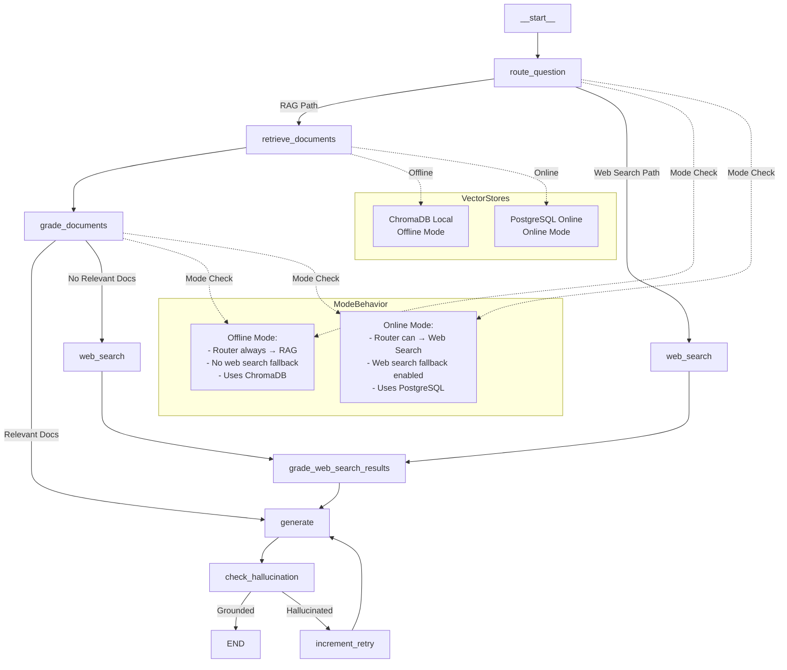

# LangGraph Helper Agent

An AI-powered assistant that helps developers work with LangGraph and LangChain by answering practical questions. Built with LangGraph and LangChain v1, supporting both offline and online modes for different usage scenarios.

## Features

- **Dual Operating Modes**: Offline (local documentation) and Online (real-time web search)
- **Advanced RAG**: Semantic search with query expansion, hybrid search, metadata boosting, and reranking
- **Intelligent Routing**: LLM-powered decision making for RAG vs web search
- **Hallucination Detection**: Automatic validation and retry mechanism
- **Incremental Updates**: Automated watchdog system for keeping documentation fresh
- **Streamlit GUI**: User-friendly web interface
- **Production Ready**: PostgreSQL support for scalable deployments

---

## Architecture Overview

The agent is built using **LangGraph** for workflow orchestration and **LangChain** for LLM integration. The architecture follows a state-based graph design with conditional routing and multiple fallback mechanisms.

### Graph Design

The workflow consists of 8 nodes connected through conditional and sequential edges:

1. **route_question**: Determines whether to use RAG (vector store) or web search
2. **retrieve_documents**: Retrieves relevant documents from vector store (ChromaDB or PostgreSQL)
3. **grade_documents**: Evaluates document relevance using LLM
4. **web_search**: Performs Tavily web search (online mode only) with domain filtering and query enhancement
5. **grade_web_search_results**: Evaluates web search result relevance using LLM grading
6. **generate**: Generates answer using LLM with context from documents
7. **check_hallucination**: Validates answer is grounded in source documents
8. **increment_retry**: Handles retry logic for hallucinated responses

**Graph Structure**



**Graph Flow:**
```
route_question → [RAG Path: retrieve_documents → grade_documents → generate]
                [Web Search Path: web_search → grade_web_search_results → generate]
                
generate → check_hallucination → [END | increment_retry → generate (loop)]
```

For detailed graph architecture, node specifications, and state management, see [`documentation/graph_design.md`](documentation/graph_design.md).

### State Management

The graph uses a `GraphState` TypedDict that flows through all nodes:

- **Input**: `question` (user's query)
- **Routing**: `web_search` flag, routing decisions
- **Retrieval**: `documents`, `document_scores`
- **Grading**: `graded_documents`, `grading_scores`
- **Generation**: `generation`, `generation_sources`
- **Validation**: `is_grounded`, `hallucination_score`
- **Retry**: `retries` counter
- **Metadata**: Debugging and logging information

State is replaced (not accumulated) at each node to ensure clean data flow. See [`documentation/graph_design.md`](documentation/graph_design.md#state-schema) for complete state schema.

### Node Structure

Each node is a pure function that:
- Takes `GraphState` as input
- Returns updated `GraphState`
- Logs execution with mode-aware prefixes (`[MODE]`)
- Handles errors gracefully

Nodes are connected via:
- **Sequential edges**: Direct flow (e.g., `retrieve_documents` → `grade_documents`)
- **Conditional edges**: Branch based on state (e.g., router decision, grade results)

For complete node specifications, see [`documentation/graph_design.md`](documentation/graph_design.md#node-details).

---

## Operating Modes

The agent supports two distinct modes controlled via the `AGENT_MODE` environment variable:

### Offline Mode (`AGENT_MODE=offline`)

- **Vector Store**: ChromaDB (local persistent storage)
- **Web Search**: Disabled
- **Data**: Uses locally downloaded documentation
- **Use Case**: Works without internet (except for LLM API calls)

### Online Mode (`AGENT_MODE=online`)

- **Vector Store**: PostgreSQL with pgvector
- **Web Search**: Enabled via Tavily API
- **Data**: Can access live documentation and web information
- **Use Case**: Real-time information access

For detailed mode behavior, fallback mechanisms, and routing logic, see [`documentation/graph_design.md`](documentation/graph_design.md#mode-specific-behavior).

---

## Data Freshness Strategy

### Offline Mode

**Initial Data Preparation:**
1. Download documentation from `llms.txt` sources
2. Parse markdown files and chunk by headings
3. Generate embeddings using Google Gemini (`gemini-embedding-001`, 3072 dimensions)
4. Store in ChromaDB with metadata (topics, keywords, file paths)

**Update Methods:**

**Automated (Recommended):**
- **Watchdog System**: Incremental updates that only process changed files
- Monitors `llms.txt` files for new/removed URLs
- Detects file changes via checksum comparison
- Re-indexes only modified files (~10x faster than full re-index)
- Can run continuously or on schedule

**Manual:**
- Full re-download and re-index when needed

### Online Mode

**Vector Store (PostgreSQL):**
- Initial migration from ChromaDB or direct indexing
- Updates via watchdog + migration, or direct PostgreSQL indexing

**Web Search (Tavily):**
- Always fresh - queries live web in real-time
- No updates needed
- **Domain Filtering**: Restricts to official documentation domains (langchain-ai.github.io, docs.langchain.com, python.langchain.com, github.com/langchain-ai)
- **Advanced Search**: Uses `search_depth="advanced"` for better content extraction
- **Query Enhancement**: Automatically adds "LangGraph" context to queries when needed
- **Smart Fallback**: Uses results even if graded as irrelevant (ensures answers are generated)

For comprehensive data freshness documentation, update procedures, and watchdog system details, see [`documentation/DATA_UPDATE_STRATEGY.md`](documentation/DATA_UPDATE_STRATEGY.md).

---

## Setup Instructions

### Prerequisites

- Python 3.10 or higher
- pip or uv package manager
- Google API key (for Gemini LLM)
- Tavily API key (optional, for online mode web search)
- PostgreSQL with pgvector extension (optional, for online mode)

### Step 1: Clone Repository

```bash
git clone https://github.com/Kochurovskyi/dual-rag.git
cd asistant
```

### Step 2: Create Virtual Environment

```bash
# Using venv
python -m venv .venv
source .venv/bin/activate  # On Windows: .venv\Scripts\activate

# Or using uv (recommended)
uv venv
source .venv/bin/activate  # On Windows: .venv\Scripts\activate
```

### Step 3: Install Dependencies

```bash
# Using pip
pip install -r requirements.txt

# Or using uv (faster)
uv pip install -r requirements.txt
```

### Step 4: Configure Environment Variables

Create a `.env` file in the project root:

```bash
# Required: Google Gemini API Key
GOOGLE_API_KEY=your_google_api_key_here

# Optional: For online mode
AGENT_MODE=online  # initial state but fille free to set up "offline"
TAVILY_API_KEY=your_tavily_api_key_here  # Required for online mode web search

# Optional: PostgreSQL configuration (for online mode)
POSTGRES_HOST=rag-assistant-pg-db.eu-central-1.elasticbeanstalk.com
POSTGRES_PORT=5432
POSTGRES_DB=documentation_search
POSTGRES_USER=postgres
POSTGRES_PASSWORD=postgres
POSTGRES_VECTOR_TABLE=langchain_document_vectors
```

**Get API Keys:**
- **Google Gemini**: [Google AI Studio](https://makersuite.google.com/app/apikey)
- **Tavily**: [Tavily Dashboard](https://app.tavily.com/) (free tier: 1,000 requests/month)

### Step 5: Documentation Data

**Pre-indexed Data Available:**

The repository includes pre-downloaded and indexed documentation:
- **Documentation files**: Already downloaded in `docs/langgraph/` and `docs/langchain/`
- **ChromaDB index**: Pre-built index available in `index/` folder
- **Metadata**: Download and indexing metadata available in `metadata/` folder

You can start using the application immediately without downloading or indexing.

**Optional: Re-download or Update Documentation**

If you need to update the documentation or re-index:

```bash
# Download LangGraph and LangChain documentation
python ingestion/download_docs.py
```

This will:
- Fetch `llms.txt` files from configured sources
- Download all markdown documentation files
- Organize into `docs/langgraph/` and `docs/langchain/`
- Save metadata to `metadata/download_metadata.json`

```bash
# Index all downloaded files
python -m ingestion.indexer
```

This will:
- Parse markdown files and chunk by headings
- Generate embeddings using Google Gemini
- Store in ChromaDB (offline) or PostgreSQL (online)
- Save indexing metadata

**Note**: For online mode with PostgreSQL, ensure PostgreSQL is running and pgvector extension is installed. See [`utility_scripts/enable_pgvector_eb.py`](utility_scripts/enable_pgvector_eb.py) for enabling pgvector.

### Step 7: Run the Application

**Streamlit GUI (Recommended):**
```bash
streamlit run app.py
```

The application will open in your browser at `http://localhost:8501`.

**GUI Interface:**

The Streamlit GUI provides an intuitive interface with two main sections:

**Left Sidebar - Configuration Panel:**
- **Mode Selection**: Radio buttons to switch between "Offline" and "Online" modes
- **Current Status Display**:
  - Current Mode (OFFLINE/ONLINE)
  - Vector Store (ChromaDB/PostgreSQL)
  - Web Search status (Enabled/Disabled)
- **API Keys**: Validation status with green checkmarks when valid
  - Google API Key validation
  - Tavily API Key validation (online mode)
- **Example Questions**: Pre-defined questions for quick testing:
  - "What is LangGraph?"
  - "How do I add persistence to a LangGraph agent?"
  - "What's the difference between StateGraph and MessageGraph?"
  - "How to handle errors in LangChain?"
  - And more...

**Main Panel - Query and Results:**
- **Query Input**: Text field to enter your question
- **Run Button**: Execute the query (rocket icon)
- **Answer Display**:
  - Formatted answer with citations (Document 1, Document 2, etc.)
  - Code examples with syntax highlighting
  - Bullet points and structured formatting
  - Source attribution (e.g., "Source: RAG (ChromaDB)")
- **Expandable Sections**:
  - **View Source URLs/Paths**: Click to see document sources
  - **Statistics**: View retrieval and generation statistics

**GUI Usage Flow:**
1. Select mode (Offline/Online) in the sidebar
2. Choose an example question or enter your own
3. Click "Run" button
4. View answer with citations and code examples
5. Expand sections to see sources and statistics

**CLI (Alternative):**
```bash
python cli.py "How do I add persistence to a LangGraph agent?"
```

### Example Run

**Streamlit GUI:**
```bash
# Set offline mode
export AGENT_MODE=offline

# Run Streamlit
streamlit run app.py

# In the GUI, ask: "How do I add persistence to a LangGraph agent?"
# The agent will:
# 1. Route to RAG (offline mode)
# 2. Retrieve relevant documents from ChromaDB
# 3. Grade documents for relevance
# 4. Generate answer with citations
# 5. Validate answer is grounded
# 6. Display result
```

**CLI Example Output:**

**Offline Mode:**
```bash
$ python cli.py --mode offline "What is LangGraph?"

Answer:
--------------------------------------------------------------------------------
LangGraph is a low-level orchestration framework and runtime for building, 
managing, and deploying long-running, stateful agents. It is focused entirely 
on agent orchestration, providing underlying capabilities important for agent 
orchestration, such as durable execution, streaming, and human-in-the-loop.

Key aspects of LangGraph include:
* Purpose: Designing agents that reliably handle complex tasks
* Focus: Providing underlying capabilities for agent orchestration
* Level: Very low-level framework focused on orchestration
* Integration: Integrates seamlessly with LangChain components

Core benefits include durable execution, human-in-the-loop capabilities, 
comprehensive memory, debugging with LangSmith, and production-ready deployment.
--------------------------------------------------------------------------------

Sources:
  1. langgraph/langgraph/index/index.md
  2. langchain/oss/javascript/langgraph/overview.md

[OK] Answer is grounded in source documents
```

**Online Mode with Verbose Output:**
```bash
$ python cli.py --mode online --verbose "How do I add persistence to a LangGraph agent?"

Mode: ONLINE
Question: How do I add persistence to a LangGraph agent?
================================================================================

Answer:
--------------------------------------------------------------------------------
To add persistence to a LangGraph agent, you need to use checkpointers. 
Checkpointers allow you to save and restore agent state, enabling durable 
execution across restarts.

Here's how to add persistence:

1. Import a checkpoint adapter (e.g., MemorySaver for in-memory persistence)
2. Create a checkpointer instance
3. Pass it to the graph's compile() method

Example:
```python
from langgraph.checkpoint.memory import MemorySaver

checkpointer = MemorySaver()
app = graph.compile(checkpointer=checkpointer)
```

For production use, consider using database-backed checkpointers like 
PostgreSQL or SQLite for persistent storage across restarts.
--------------------------------------------------------------------------------

Sources:
  1. langgraph/langgraph/how-tos/persistence.md
  2. langgraph/langgraph/concepts/persistence.md

Metadata:
  Generation source: rag
  Generation length: 847 characters
  Documents retrieved: 8
  Documents graded: 3
  Web search performed: False
  Is grounded: True
  Retries: 0

[OK] Answer is grounded in source documents
```

**Online Mode with Web Search Fallback:**
```bash
$ python cli.py --mode online "What's the difference between StateGraph and MessageGraph?"

Answer:
--------------------------------------------------------------------------------
Based on the provided documents:

The primary difference between `StateGraph` and `MessageGraph` lies in how 
they model their state:

* **`StateGraph`**: A generalized graph that can model arbitrary state using 
  a dict. It is not limited to just a list of messages.
* **`MessageGraph`**: A graph that specifically models its state as a list 
  of messages.

Furthermore, `MessageGraph` is being deprecated in LangGraph v1.0.0, to be 
removed in v2.0.0. Please use StateGraph with a `messages` key instead.
--------------------------------------------------------------------------------

Sources:
  1. https://github.com/langchain-ai/langgraph/blob/main/libs/langgraph/langgraph/graph/message.py
  2. https://docs.langchain.com/oss/python/langgraph/overview

[OK] Answer is grounded in source documents
```

**Note**: When web search is used, the system:
- Searches official documentation domains only
- Grades results for relevance
- Uses smart fallback if all results are filtered (ensures answers are generated)
- Provides source URLs for verification

**Interactive Mode:**
```bash
$ python cli.py --mode offline --interactive

Entering interactive mode (Mode: OFFLINE).
Type 'quit' or 'exit' to exit.
================================================================================

Query: What's the difference between StateGraph and MessageGraph?
Answer:
--------------------------------------------------------------------------------
StateGraph and MessageGraph are two different graph types in LangGraph:

**StateGraph:**
- Uses a custom state schema (TypedDict)
- More flexible, allows custom state structure
- You define what data flows through the graph
- Better for complex workflows with structured data

**MessageGraph:**
- Uses MessagesState (list of messages)
- Simpler, message-based communication
- Automatically handles message formatting
- Better for conversational agents

The main difference is the state structure: StateGraph uses custom schemas, 
while MessageGraph uses a standardized message list.
--------------------------------------------------------------------------------

Sources:
  1. langgraph/langgraph/concepts/low_level.md
  2. langgraph/langgraph/concepts/messages.md

[OK] Answer is grounded in source documents

Query: quit
```

---

## Version Specifications

- **Python**: 3.10+
- **LangGraph**: >=1.0.0,<2.0.0 (v1)
- **LangChain**: >=1.0.0,<2.0.0 (v1)
- **Google Gemini**: gemini-2.5-flash (LLM), gemini-embedding-001 (embeddings)
- **ChromaDB**: >=0.4.0
- **PostgreSQL**: 16+ (with pgvector extension)
- **Streamlit**: >=1.28.0

See [`requirements.txt`](requirements.txt) for complete dependency list.

---

## External Services Documentation

### Google Gemini

**Service**: Google Generative AI (Gemini)

**Why We Chose It:**
- Free tier with generous rate limits
- High-quality embeddings (3072 dimensions for documents)
- Fast inference for both LLM and embeddings
- Reliable API with good documentation

**How to Obtain API Key:**
1. Visit [Google AI Studio](https://makersuite.google.com/app/apikey)
2. Sign in with your Google account
3. Click "Create API Key"
4. Copy the API key to your `.env` file as `GOOGLE_API_KEY`

**Rate Limits:**
- Free tier: 60 requests per minute (RPM)
- See [Google AI Studio Rate Limits](https://ai.google.dev/pricing) for details

**Usage:**
- **LLM**: `gemini-2.5-flash` for generation, grading, routing
- **Embeddings**: `gemini-embedding-001` with `RETRIEVAL_DOCUMENT` task type (3072 dims)

For more details on LLM and embedding configuration, see [`documentation/graph_design.md`](documentation/graph_design.md).

### Tavily API

**Service**: Tavily Search API

**Why We Chose It:**
- Free tier: 1,000 requests/month
- Fast API response times
- Domain filtering support (restricts to documentation domains)
- Optimized for technical documentation
- Simple integration

**How to Obtain API Key:**
1. Visit [Tavily Dashboard](https://app.tavily.com/)
2. Sign up for a free account
3. Navigate to API Keys section
4. Copy the API key to your `.env` file as `TAVILY_API_KEY`

**Configuration:**
- Automatically enabled when `AGENT_MODE=online`
- **Domain Filtering**: Restricts searches to official documentation domains:
  - `langchain-ai.github.io` (LangGraph docs)
  - `docs.langchain.com` (LangChain docs)
  - `python.langchain.com` (LangChain Python)
  - `github.com/langchain-ai` (LangGraph/LangChain repositories)
- **Search Parameters**:
  - `search_depth="advanced"` for better content extraction
  - `max_results=5` for more comprehensive results
  - Query enhancement: Automatically adds "LangGraph" context if not present

**Usage:**
- Used in `web_search` node for real-time information retrieval
- Results are graded for relevance using LLM
- **Smart Fallback**: If all results are filtered as irrelevant, system uses them anyway (less strict filtering)
- Fallback mechanism when vector store has no relevant documents
- Pure LLM fallback if no web search results available

For web search architecture and domain filtering details, see [`documentation/DATA_UPDATE_STRATEGY.md`](documentation/DATA_UPDATE_STRATEGY.md#online-mode---data-preparation).

### PostgreSQL + pgvector

**Service**: PostgreSQL with pgvector extension

**Why We Chose It:**
- Scalable vector storage for production deployments
- Persistent storage (survives instance restarts)
- Industry-standard database with pgvector extension
- Supports remote deployments (e.g., AWS Elastic Beanstalk)

**Setup:**
- Requires PostgreSQL 16+ with pgvector extension
- Table: `langchain_document_vectors`
- Vector size: 3072 dimensions (matches Google Gemini embeddings)

**Configuration:**
- Set `AGENT_MODE=online` to use PostgreSQL
- Configure connection via environment variables:
  - `POSTGRES_HOST`, `POSTGRES_PORT`, `POSTGRES_DB`, `POSTGRES_USER`, `POSTGRES_PASSWORD`

For PostgreSQL setup and migration procedures, see [`documentation/DATA_UPDATE_STRATEGY.md`](documentation/DATA_UPDATE_STRATEGY.md#online-mode---data-preparation).

---

## Data Update Strategy

### Automated Updates (Recommended)

The **Watchdog System** (`ingestion/watchdog.py`) provides incremental updates:

**How It Works:**
1. **URL Monitoring**: Checks `llms.txt` files for new/removed URLs
2. **Change Detection**: Compares file checksums to detect modifications
3. **Incremental Processing**: Downloads only new files, re-indexes only changed files
4. **Registry Tracking**: Maintains `metadata/file_registry.json` with checksums

**Usage:**

```bash
# One-time check for updates
python -m ingestion.watchdog --check

# Continuous monitoring (checks every hour)
python -m ingestion.watchdog --watch --interval 3600

# Check specific source only
python -m ingestion.watchdog --check --source langgraph
```

**Benefits:**
- **Efficient**: Only updates changed files (~10x faster than full re-index)
- **Automated**: Can run continuously or on schedule (cron/Task Scheduler)
- **Reliable**: Checksum-based change detection ensures accuracy

### Manual Updates

**Full Refresh:**
```bash
# Re-download all files
python ingestion/download_docs.py

# Re-index everything
python -m ingestion.indexer
```

**Source-Specific Update:**
```bash
# Update only LangGraph
python ingestion/download_docs.py --source langgraph
python -m ingestion.indexer --source langgraph
```

### Online Mode Updates

**PostgreSQL Vector Store:**
```bash
# Method 1: Watchdog + Migration
python -m ingestion.watchdog --check
python utility_scripts/migrate_to_eb.py

# Method 2: Direct PostgreSQL indexing
export AGENT_MODE=online
python -m ingestion.indexer
```

**Web Search (Tavily):**
- No updates needed - queries live web in real-time
- Always returns current information

### Scheduled Updates

**Linux/Mac (Cron):**
```bash
# Add to crontab (runs daily at 2 AM)
0 2 * * * cd /path/to/project && python -m ingestion.watchdog --check
```

**Windows (Task Scheduler):**
- Create scheduled task to run: `python -m ingestion.watchdog --check`

---

## Mode Switching Examples

The agent supports mode switching via environment variable or Streamlit GUI.

### Environment Variable Method

**Offline Mode:**

Using `--mode` flag (recommended):
```bash
# CLI with flag
python cli.py --mode offline "How do I use checkpointers?"

# Streamlit (set in GUI settings)
streamlit run app.py
```

Using environment variable:
```bash
# Set offline mode
export AGENT_MODE=offline

# Run CLI
python cli.py "How do I use checkpointers?"

# Or Streamlit
streamlit run app.py
```

**Online Mode:**

Using `--mode` flag (recommended):
```bash
# CLI with flag
python cli.py --mode online "What are the latest LangGraph features?"

# Streamlit (set in GUI settings)
streamlit run app.py
```

Using environment variable:
```bash
# Set online mode
export AGENT_MODE=online

# Ensure Tavily API key is configured
export TAVILY_API_KEY=your_key_here

# Run CLI
python cli.py "What are the latest LangGraph features?"

# Or Streamlit
streamlit run app.py
```

### Streamlit GUI Method

1. Open the application: `streamlit run app.py`
2. Navigate to **Configuration** panel in the left sidebar
3. Select **Mode**: "Offline" or "Online" using radio buttons
4. Mode change takes effect immediately (no need to click apply)
5. Current mode, vector store, and web search status are displayed
6. API keys are validated automatically (green checkmark when valid)
7. Use example questions or enter your own query in the main panel
8. Click **Run** button to execute the query
9. View answer with sources, statistics, and code examples

**GUI Interface Overview:**
- **Left Sidebar**: Configuration panel with mode selection, API key status, and example questions
- **Main Panel**: Query input, answer display with citations, source URLs, and statistics
- **Answer Format**: Includes definitions, code examples, document references, and source attribution

### Mode Behavior Differences

**Offline Mode:**
- Router always routes to RAG (vector store)
- Web search disabled (returns empty results gracefully)
- Uses ChromaDB for vector storage
- Pure LLM fallback when no documents found

**Online Mode:**
- Router can route to web search based on LLM decision
- Web search enabled (Tavily API with domain filtering)
- Uses PostgreSQL for vector storage
- Falls back to web search when no relevant documents
- Smart fallback: Uses web search results even if graded as irrelevant (less strict filtering)
- Pure LLM fallback if no web search results available

For detailed mode behavior and routing logic, see [`documentation/graph_design.md`](documentation/graph_design.md#mode-specific-behavior).

### Example Queries by Mode

**Offline Mode Examples:**
```bash
# Using --mode flag (recommended)
python cli.py --mode offline "How do I add persistence to a LangGraph agent?"
python cli.py --mode offline "What's the difference between StateGraph and MessageGraph?"
python cli.py --mode offline "Show me how to implement human-in-the-loop with LangGraph"

# Or using environment variable
export AGENT_MODE=offline
python cli.py "How do I use checkpointers?"
```

**Online Mode Examples:**
```bash
# Using --mode flag (recommended)
python cli.py --mode online "What are the latest LangGraph features?"
python cli.py --mode online "What's new in LangChain v1?"
python cli.py --mode online "How do I handle errors and retries in LangGraph nodes?"
python cli.py --mode online "What's the difference between StateGraph and MessageGraph?"

# Or using environment variable
export AGENT_MODE=online
python cli.py "What are the latest LangGraph features?"
```

**Example Output (Online Mode with Web Search):**
```bash
$ python cli.py --mode online "What's the difference between StateGraph and MessageGraph?"

Answer:
--------------------------------------------------------------------------------
Based on the provided documents:

The primary difference between `StateGraph` and `MessageGraph` lies in how 
they model their state:

* **`StateGraph`**: A generalized graph that can model arbitrary state using 
  a dict. It is not limited to just a list of messages.
* **`MessageGraph`**: A graph that specifically models its state as a list 
  of messages.

Furthermore, `MessageGraph` is being deprecated in LangGraph v1.0.0, to be 
removed in v2.0.0. Please use StateGraph with a `messages` key instead.
--------------------------------------------------------------------------------

Sources:
  1. https://github.com/langchain-ai/langgraph/blob/main/libs/langgraph/langgraph/graph/message.py
  2. https://docs.langchain.com/oss/python/langgraph/overview

[OK] Answer is grounded in source documents
```

**Interactive Mode:**
```bash
# Interactive mode with mode flag
python cli.py --mode offline --interactive
python cli.py --mode online --interactive

# Verbose output
python cli.py --mode offline --verbose "How do I add persistence to a LangGraph agent?"
```

---

## Portability Requirements

The solution is designed to run on any machine with proper setup:

**Requirements:**
- Python 3.10+ installed
- Virtual environment support
- Internet access (for LLM API calls, optional for web search)
- PostgreSQL (optional, for online mode)

**Setup Process:**
1. Clone repository
2. Create virtual environment
3. Install dependencies (`pip install -r requirements.txt`)
4. Configure `.env` file with API keys
5. Download and index documentation (offline mode)
6. Run application

**Dependency Management:**
- All dependencies specified in `requirements.txt`
- Version constraints ensure compatibility
- No system-level dependencies beyond Python

**Environment Configuration:**
- All configuration via `.env` file (not committed to git)
- Environment variables override defaults
- Clear documentation for all required variables

For complete setup instructions, see [Setup Instructions](#setup-instructions) section. For deployment to production environments (e.g., AWS Elastic Beanstalk), see [`documentation/DATA_UPDATE_STRATEGY.md`](documentation/DATA_UPDATE_STRATEGY.md#online-mode---data-preparation).

---

## Example Questions

The agent can handle various types of questions about LangGraph and LangChain:

- "How do I add persistence to a LangGraph agent?"
- "What's the difference between StateGraph and MessageGraph?"
- "Show me how to implement human-in-the-loop with LangGraph"
- "How do I handle errors and retries in LangGraph nodes?"
- "What are best practices for state management in LangGraph?"
- "How do I use checkpointers in LangGraph?"
- "What are the latest LangGraph features?" (online mode)
- "How do I build a multi-agent system with LangChain?"

---

## Project Structure

```
.
├── app.py                    # Streamlit GUI
├── config.py                 # Configuration
├── query_engine.py           # Query engine with RAG improvements
├── query_expander.py         # Query expansion utilities
├── reranker.py              # Cross-encoder reranking
├── requirements.txt          # Dependencies
├── .env                      # Environment variables (not in git)
│
├── graph/                    # LangGraph workflow
│   ├── graph.py             # Graph definition and nodes
│   ├── state.py             # GraphState TypedDict
│   ├── chains/              # LangChain chains
│   │   ├── router.py       # Routing chain
│   │   ├── retrieval_grader.py  # Document grading
│   │   ├── generation.py   # Answer generation
│   │   └── hallucination_grader.py  # Hallucination detection
│   └── nodes/               # Graph nodes
│       ├── web_search.py    # Web search node
│       └── grade_web_search.py  # Web search grading
│
├── ingestion/               # Data ingestion
│   ├── download_docs.py    # Download script
│   ├── indexer.py          # Indexing system
│   ├── chunker.py          # Markdown chunking
│   ├── watchdog.py         # Incremental updates
│   └── file_registry.py    # File tracking
│
├── cli.py                   # CLI interface
│
├── utility_scripts/         # Utility scripts
│   ├── migrate_to_eb.py    # PostgreSQL migration
│   └── enable_pgvector_eb.py  # pgvector setup
│
├── documentation/           # Detailed documentation
│   ├── graph_design.md     # Architecture details
│   └── DATA_UPDATE_STRATEGY.md  # Data freshness strategy
│
├── docs/                    # Downloaded documentation
│   ├── langgraph/          # LangGraph MD files
│   └── langchain/          # LangChain MD files
│
├── index/                   # ChromaDB storage (offline)
└── metadata/                # Metadata and registry
```

---

## License

[Specify your license here]

---

## Contributing

[Contributing guidelines if applicable]

---

## Support

For issues, questions, or contributions, please [open an issue](repository-url/issues) or [create a pull request](repository-url/pulls).
