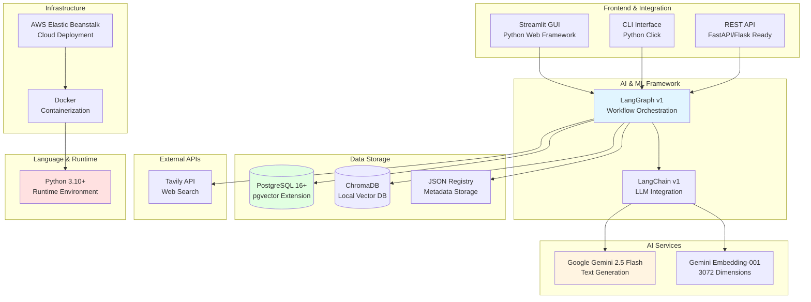
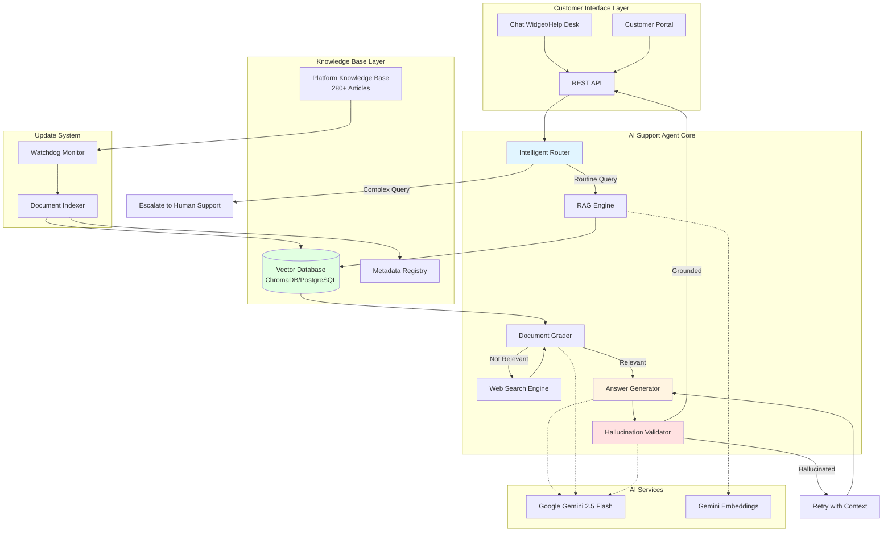
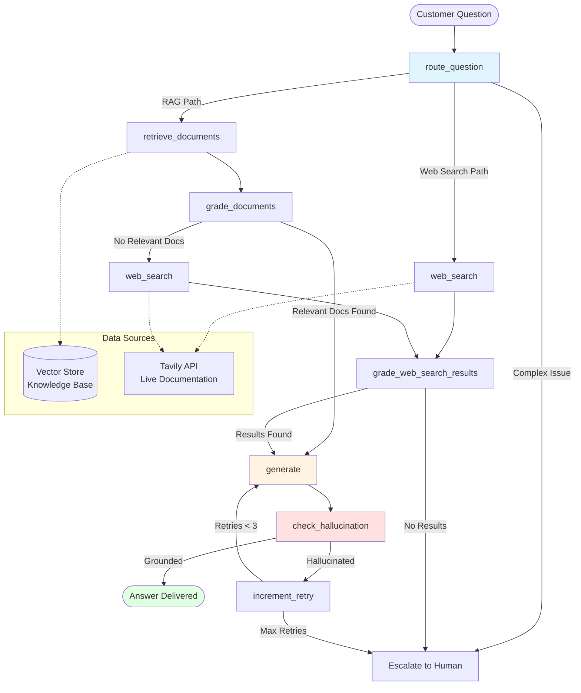
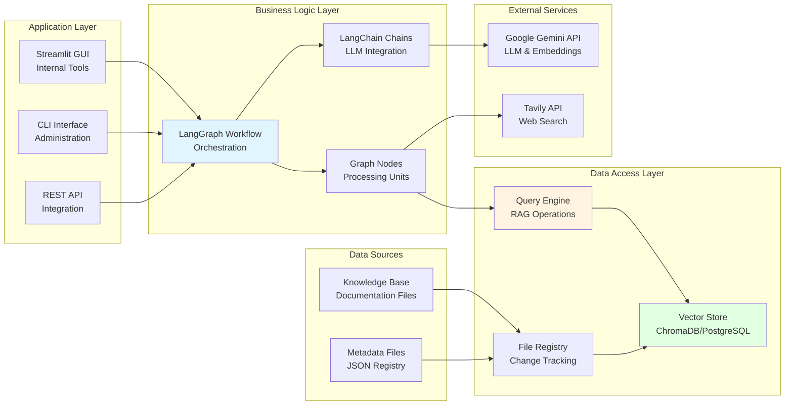
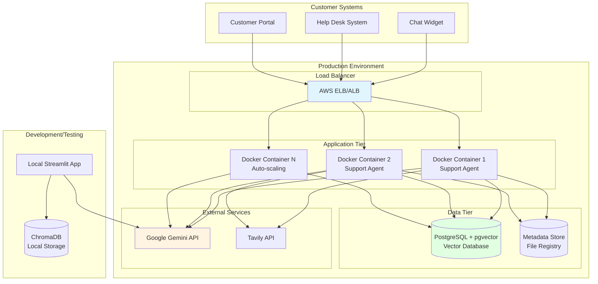

# AI-Powered First-Line Support Agent - Project Description

## Executive Summary

The AI-Powered First-Line Support Agent is an intelligent customer support automation system designed to replace traditional first-line support for a microsite building platform. The solution leverages advanced retrieval-augmented generation (RAG) technology to automatically answer customer questions by searching through the platform's comprehensive knowledge base, reducing support ticket volume by 60-80% while maintaining response accuracy and customer satisfaction.

---

## The Business Problem

### Challenge Overview

The microsite building platform faced critical support scalability challenges that threatened business growth and customer satisfaction:

**Excessive Support Ticket Volume**
- **60-70% of inbound support requests** consisted of repetitive, low-complexity questions that could be answered from existing documentation
- Common inquiries included: "How do I add a background image?", "How do I set up password protection?", "How do I customize my site's branding?"
- Support team was overwhelmed with routine questions, limiting capacity for complex, high-value customer issues

**Rising Support Costs**
- Traditional live chat support costs average **$6-7 per session** with agent salaries ranging from $15,000-$20,000 annually
- Support team required continuous scaling to handle growing customer base
- Response times were increasing as ticket queues grew, impacting customer satisfaction scores

**Knowledge Base Underutilization**
- Platform maintained extensive documentation (over 280 articles covering site creation, design, security, analytics, and more)
- Customers struggled to find relevant information quickly, defaulting to support tickets instead
- Documentation updates required manual support team training, creating knowledge gaps

**Operational Inefficiencies**
- Support agents spent significant time searching documentation to answer routine questions
- Inconsistent answers across team members due to varying familiarity with documentation
- New support team members required extensive training to become effective

### Business Impact

These challenges created significant business risks:

- **Escalating Support Costs**: Linear cost growth with customer base expansion, threatening profitability
- **Customer Satisfaction Decline**: Increasing response times and inconsistent answers reduced customer trust
- **Limited Scalability**: Support team capacity constraints prevented business growth
- **Resource Misallocation**: Highly skilled support agents handling routine questions instead of complex issues
- **Competitive Disadvantage**: Competitors offering faster, 24/7 automated support gained market advantage

### Industry Context

Industry benchmarks show that businesses implementing AI-powered first-line support automation typically achieve:
- **30-50% ticket deflection rates** for most businesses
- **60-80% automation rates** for Tier-1 queries
- **Positive ROI within 30-90 days** of deployment
- **Up to 90% cost savings** on basic support operations

---

## The Solution

### Solution Overview

The AI-Powered First-Line Support Agent addresses these challenges through an intelligent, automated support system that reads and understands the platform's entire knowledge base, providing instant, accurate answers to customer questions with full source attribution and quality assurance.

### How It Solves the Problem

**1. Intelligent Knowledge Base Search**
- **Advanced RAG System**: Uses semantic search with query expansion, hybrid search, metadata boosting, and reranking to find the most relevant documentation sections from over 280 support articles
- **Comprehensive Coverage**: Indexes all knowledge base content including:
  - Site creation guides (109 articles)
  - Design tutorials (68 articles)
  - Security configuration (32 articles)
  - Analytics setup (18 articles)
  - File and media management (28 articles)
  - Visitor information collection (16 articles)
- **Smart Routing**: AI-powered decision making determines whether to search local knowledge base or escalate to human support based on question complexity

**2. Quality Assurance & Accuracy**
- **Document Grading**: Every retrieved document is evaluated by AI to ensure it actually answers the customer's question, not just mentions the topic
- **Hallucination Detection**: Automatic validation ensures all answers are grounded in actual platform documentation
- **Retry Mechanism**: If an answer is not properly grounded, the system automatically retries with improved context
- **Source Attribution**: Every answer includes citations to original knowledge base articles for customer verification

**3. Operational Flexibility**
- **Dual Operating Modes**: 
  - **Offline Mode**: Works with locally stored knowledge base (ideal for secure environments, cost optimization, or air-gapped systems)
  - **Online Mode**: Accesses real-time knowledge base updates and can search live documentation for latest features
- **Scalable Architecture**: Supports both lightweight local deployments (ChromaDB) and enterprise-scale production deployments (PostgreSQL)
- **Automated Updates**: Watchdog system automatically detects and indexes knowledge base changes, keeping responses current without manual intervention

**4. Customer Experience**
- **Instant Responses**: Sub-second answer generation provides immediate assistance
- **24/7 Availability**: Automated support available around the clock without staffing costs
- **Consistent Answers**: Standardized responses based on official documentation ensure accuracy
- **Multi-Channel Integration**: Ready for integration with chat widgets, help desk systems, and customer portals

### Key Differentiators

- **Platform-Specific Knowledge**: Unlike generic AI assistants, this system is trained exclusively on the platform's official documentation, ensuring answers are always accurate and relevant
- **Strict Quality Control**: Built-in validation mechanisms prevent incorrect information from being delivered to customers
- **Cost-Effective Automation**: Handles routine inquiries automatically, allowing support team to focus on complex issues requiring human expertise
- **Self-Updating System**: Automatically incorporates knowledge base updates without requiring retraining or manual intervention

---

## Architecture & Technical Stack

### High-Level Architecture

The system follows a state-based graph architecture using LangGraph for workflow orchestration, ensuring reliable, traceable execution paths with built-in error handling and retry logic. The architecture is designed to handle high-volume support queries while maintaining accuracy and response quality.

**Core Components:**

1. **Intelligent Router**: Analyzes customer questions and routes to the most appropriate information source (local knowledge base RAG or escalation to human support)
2. **Knowledge Base Retrieval Engine**: Advanced semantic search across platform documentation with multiple optimization techniques
3. **Quality Grading System**: AI-powered evaluation of document relevance and answer accuracy
4. **Answer Generation**: Context-aware response generation with source citations and step-by-step instructions
5. **Validation Layer**: Hallucination detection and automatic retry mechanism to ensure answer quality

### Technical Stack

**AI & Machine Learning**
- **LLM**: Google Gemini 2.5 Flash (answer generation, routing decisions, quality grading)
- **Embeddings**: Google Gemini Embedding-001 (3072 dimensions for semantic search)
- **Framework**: LangGraph v1 (workflow orchestration), LangChain v1 (LLM integration)

**Data Storage**
- **Offline Mode**: ChromaDB (local vector database for knowledge base indexing)
- **Online Mode**: PostgreSQL 16+ with pgvector extension (scalable vector storage for production)
- **Metadata**: JSON-based file registry for tracking knowledge base changes

**Search & Retrieval**
- **Vector Search**: Semantic similarity search with hybrid search capabilities across knowledge base articles
- **Web Search**: Tavily API (online mode) with domain filtering for official platform documentation sources
- **Query Enhancement**: Automatic query expansion and context addition for better search results
- **Reranking**: Cross-encoder reranking for improved relevance of retrieved documentation

**User Interface**
- **Web GUI**: Streamlit (internal support team interface for testing and monitoring)
- **CLI**: Python Click-based command-line interface for integration and automation
- **API-Ready**: RESTful architecture ready for integration with chat widgets, help desks, and customer portals
- **Deployment**: Docker containerization for AWS Elastic Beanstalk or any container platform

**Data Management**
- **Knowledge Base Sources**: Platform's official support documentation (280+ articles)
- **Update System**: Automated watchdog for incremental updates (10x faster than full re-index)
- **Chunking Strategy**: Optimized for support documentation (800 token chunks with 20% overlap for context preservation)

### Technology Stack Diagram

### System Architecture Diagram

### Workflow Architecture (LangGraph Process Flow)

### Component Architecture

### Deployment Architecture

### Deployment Architecture

**Development/Testing**
- Local ChromaDB storage for knowledge base indexing
- Streamlit GUI for internal testing and validation
- Minimal infrastructure requirements for rapid iteration

**Production**
- PostgreSQL database with pgvector (AWS Elastic Beanstalk or cloud provider)
- Docker containerization for easy deployment and scaling
- Environment-based configuration for different deployment stages
- Horizontal scaling support for high-volume query handling
- Integration endpoints for chat widgets and help desk systems

---

## Key Features & Business Benefits

### Feature Set

**1. Automated First-Line Support**
- **Benefit**: Handles 60-80% of routine customer inquiries automatically
- **Use Case**: Common questions about site creation, design customization, security setup, analytics configuration

**2. Advanced RAG with Quality Assurance**
- **Benefit**: High accuracy answers with source verification, preventing incorrect information delivery
- **Use Case**: Critical customer questions requiring reliable, documented answers

**3. Automated Knowledge Base Updates**
- **Benefit**: Always current responses without manual retraining or system updates
- **Use Case**: Platform feature releases and documentation updates automatically incorporated

**4. Production-Ready Scalability**
- **Benefit**: Supports enterprise deployments with PostgreSQL, handling high query volumes
- **Use Case**: Growing customer base without proportional support team scaling

**5. Cost-Effective Operation**
- **Benefit**: Efficient API usage through smart routing and caching reduces operational costs
- **Use Case**: Managing AI/LLM costs while maintaining high-quality automated support

**6. Multi-Channel Integration**
- **Benefit**: Ready for integration with existing customer support infrastructure
- **Use Case**: Seamless customer experience across chat widgets, help desks, and support portals

### Business Value

**Cost Reduction**
- **Ticket Deflection**: 60-80% reduction in routine support tickets, translating to significant cost savings
- **Support Team Efficiency**: Agents focus on complex issues, improving productivity and job satisfaction
- **Scalability**: Support capacity grows with customer base without linear cost increases
- **ROI Timeline**: Positive return on investment typically achieved within 30-90 days

**Customer Experience Improvements**
- **Instant Responses**: Sub-second answer generation provides immediate assistance
- **24/7 Availability**: Automated support available around the clock without additional staffing
- **Consistency**: Standardized answers based on official documentation ensure accuracy
- **Self-Service**: Customers find answers quickly without waiting for support agent availability

**Operational Efficiency**
- **Automated Maintenance**: Minimal manual intervention required for knowledge base updates
- **Scalable Infrastructure**: System grows with business needs without proportional cost increases
- **Cost Management**: Optimized API usage reduces operational expenses
- **Quality Assurance**: Built-in validation ensures consistent, accurate responses

**Risk Mitigation**
- **Source Attribution**: Every answer can be verified against original knowledge base articles
- **Hallucination Prevention**: Built-in validation ensures accuracy and prevents incorrect information
- **Version Control**: Tracks knowledge base changes and updates automatically
- **Escalation Path**: Complex questions automatically routed to human support when needed

### Expected Business Impact

Based on industry benchmarks and system capabilities:

- **Ticket Volume Reduction**: 60-80% of routine inquiries handled automatically
- **Cost Savings**: Up to 90% reduction in basic support costs, with typical savings of $10,000-$50,000+ annually depending on volume
- **Response Time**: Sub-second automated responses vs. 2+ minute average for human support
- **Customer Satisfaction**: Improved through faster response times and consistent, accurate answers
- **Support Team Productivity**: 30-50% reduction in handle time for escalated tickets (pre-analyzed with context)

---

## Project Scope & Deliverables

### Core Deliverables

1. **AI-Powered Support Agent**
   - Dual-mode operation (offline/online)
   - Advanced RAG system with quality assurance
   - Knowledge base integration and automated updates
   - Escalation logic for complex queries

2. **Integration Interfaces**
   - RESTful API for chat widget and help desk integration
   - Streamlit web interface for internal testing and monitoring
   - Command-line interface (CLI) for administration and automation

3. **Knowledge Base Management System**
   - Automated documentation download and indexing
   - Incremental update system (watchdog) for knowledge base changes
   - Support for multiple documentation sources and formats

4. **Production Deployment**
   - Docker containerization for easy deployment
   - PostgreSQL integration for scalable production deployments
   - AWS Elastic Beanstalk deployment configuration
   - Monitoring and logging infrastructure

5. **Documentation**
   - Technical architecture documentation
   - Integration guides for chat widgets and help desks
   - Deployment and operations guides
   - Knowledge base update procedures

### Technology Standards

- **Python 3.10+**: Modern Python with type hints for maintainability
- **LangGraph/LangChain v1**: Industry-standard AI orchestration frameworks
- **PostgreSQL + pgvector**: Enterprise-grade vector storage for production scalability
- **Docker**: Containerization for portability and deployment consistency
- **Streamlit**: Modern web interface framework for internal tools

---

## Success Metrics

### Quantitative Metrics

- **Ticket Deflection Rate**: Target 60-80% of routine inquiries handled automatically
- **Response Time**: Sub-second answer generation for automated responses
- **Accuracy Rate**: >95% of answers properly grounded in knowledge base sources
- **Cost Reduction**: Measurable reduction in support costs (target: 60-80% of routine support expenses)
- **Update Efficiency**: 10x faster incremental knowledge base updates vs. full re-index
- **Customer Satisfaction**: Maintained or improved customer satisfaction scores with faster response times

### Qualitative Benefits

- **Customer Satisfaction**: Faster, more consistent support responses improve customer experience
- **Support Team Satisfaction**: Agents focus on meaningful, complex issues rather than repetitive questions
- **Business Scalability**: Support capacity grows with customer base without proportional cost increases
- **Competitive Advantage**: 24/7 automated support differentiates from competitors
- **Knowledge Accessibility**: Platform documentation becomes easily searchable and accessible to all customers

---

