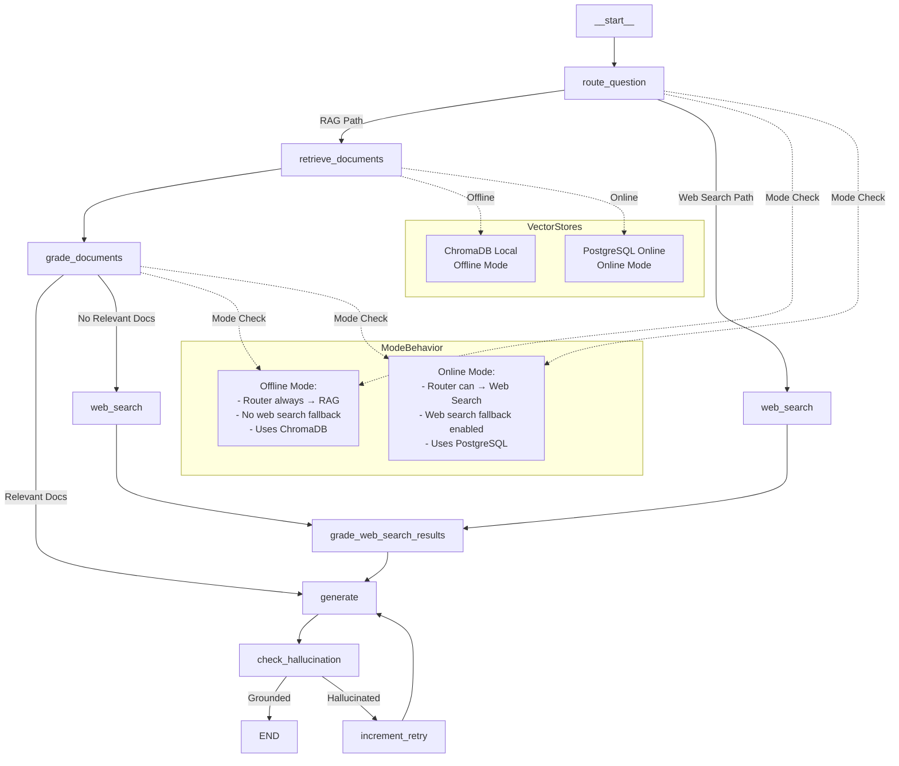

# LangGraph Workflow Architecture

## Overview

This document describes the LangGraph workflow architecture for the Advanced RAG system, supporting both offline (ChromaDB) and online (PostgreSQL + Web Search) modes.

## Graph Structure



## Node Details

### 1. route_question
**Purpose**: Determine if question should use RAG or web search

**Behavior**:
- **Offline Mode**: Always routes to RAG (vector store)
- **Online Mode**: Routes based on LLM decision (RAG or web search)

**Outputs**:
- `web_search`: Boolean flag
- `metadata.routing_decision`: "rag" or "web_search"
- `metadata.routing_reasoning`: Explanation

**Next Nodes**:
- Conditional: `retrieve_documents` OR `web_search`

### 2. retrieve_documents
**Purpose**: Retrieve documents from vector store

**Behavior**:
- Uses QueryEngine with all improvements:
  - Query expansion (use_expansion=True)
  - Hybrid search (semantic + keyword, use_hybrid=True)
  - Metadata boosting (use_metadata_boost=True)
  - Cross-encoder reranking (use_reranking=True)
- **Offline Mode**: Queries ChromaDB (VECTOR_STORE_MODE="chroma")
- **Online Mode**: Queries PostgreSQL with pgvector (VECTOR_STORE_MODE="postgres")
- Deduplicates documents by content hash (normalized whitespace)
- Searches all sources (source=None)

**Outputs**:
- `documents`: List of retrieved documents (deduplicated)
- `document_scores`: Relevance scores
- `metadata.retrieved_count`: Number of unique documents
- `metadata.duplicates_skipped`: Number of duplicates removed
- `metadata.total_before_dedup`: Total results before deduplication

**Next Nodes**:
- Always: `grade_documents`

### 3. grade_documents
**Purpose**: Evaluate document relevance using LLM

**Behavior**:
- Grades each document for relevance to question
- Filters to relevant documents only (binary_score == "yes")
- Uses retrieval grader chain

**Outputs**:
- `graded_documents`: Filtered relevant documents
- `grading_scores`: Grading scores
- `metadata.graded_count`: Number of relevant documents
- `metadata.total_documents`: Total documents graded

**Next Nodes**:
- Conditional: `generate` OR `web_search` (fallback)

### 4. web_search
**Purpose**: Perform web search using Tavily API

**Behavior**:
- **Offline Mode**: Returns empty results gracefully (WEB_SEARCH_ENABLED=False)
- **Online Mode**: Performs Tavily search with max_results=3, search_depth="basic"
- Converts results to LangChain Documents with metadata (url, title, score)
- Handles errors gracefully (missing API key, import errors, API failures)

**Outputs**:
- `web_search_results`: List of web search documents (empty if disabled/failed)
- `metadata.web_search_performed`: Boolean
- `metadata.web_search_count`: Number of results
- `metadata.web_search_reason`: Reason if search not performed

**Next Nodes**:
- Always: `grade_web_search_results`

### 5. grade_web_search_results
**Purpose**: Evaluate web search results for relevance using LLM

**Behavior**:
- Grades each web search result for relevance to question
- Filters to relevant results only (binary_score == "yes")
- Uses retrieval grader chain (same as RAG documents)

**Outputs**:
- `graded_web_search_results`: Filtered relevant web search results
- `web_search_grading_scores`: Grading scores
- `metadata.web_search_graded_count`: Number of relevant results
- `metadata.web_search_filtered_count`: Number of filtered results

**Next Nodes**:
- Always: `generate`

### 6. generate
**Purpose**: Generate answer using LLM

**Behavior**:
- Uses graded documents (RAG path) OR graded web search results (fallback) OR pure LLM fallback
- Priority order:
  1. Graded documents (RAG path) - sets `generation_source` to "rag"
  2. Graded web search results (fallback) - sets `generation_source` to "web_search"
  3. Pure LLM fallback (offline mode only, when no documents) - sets `generation_source` to "llm_guess"
  4. Online mode fallback (no docs, no web search) - sets `generation_source` to "none"
- Generates answer with source citations (empty for LLM fallback)
- Uses generation chain with context formatting
- Pure LLM fallback: Limited to ~100 words, starts with "There is no answer in knowledge base but..." prefix
- Uses `graded_web_search_results` (not raw `web_search_results`)

**Outputs**:
- `generation`: Generated answer text
- `generation_sources`: Source file paths (RAG) or URLs (web search) or empty (LLM fallback)
- `metadata.generation_length`: Answer length in characters
- `metadata.generation_source`: "rag", "web_search", "llm_guess", or "none"

**Next Nodes**:
- Always: `check_hallucination`

### 7. check_hallucination
**Purpose**: Validate answer is grounded in source documents

**Behavior**:
- Uses graded documents OR graded web search results for validation (prioritizes graded_documents)
- If no source documents, marks as not grounded (hallucination_score=0.9)
- Compares generation against source documents using LLM hallucination grader
- Returns grounded/hallucinated decision (binary_score: "yes" = grounded, "no" = hallucinated)

**Outputs**:
- `is_grounded`: Boolean (whether answer is grounded)
- `hallucination_score`: Float (0.1 if grounded, 0.9 if hallucinated)
- `metadata.hallucination_check`: Dict with check results (is_grounded, score)

**Next Nodes**:
- Conditional: `increment_retry` OR `END`

### 8. increment_retry
**Purpose**: Increment retry counter

**Behavior**:
- Increments retry count
- Logs retry attempt

**Outputs**:
- `retries`: Incremented counter

**Next Nodes**:
- Always: `generate` (loops back)

## Conditional Edges

### 1. Router Decision (`should_route_to_rag_or_web`)
**From**: `route_question`

**Logic**:
- **Offline Mode**: Always → `retrieve_documents`
- **Online Mode**: Based on routing decision
  - `routing_decision == "rag"` → `retrieve_documents`
  - `routing_decision == "web_search"` → `web_search`

### 2. Grade Decision (`should_continue`)
**From**: `grade_documents`

**Logic**:
- If `graded_documents` exist → `generate`
- If no `graded_documents`:
  - **Offline Mode**: → `generate` (pure LLM fallback with "llm_guess" source)
  - **Online Mode**: → `web_search` (fallback)

### 3. Retry Decision (`should_retry`)
**From**: `check_hallucination`

**Logic**:
- If `is_grounded == False` AND `retries < MAX_RETRIES` → `increment_retry` (returns "retry")
- Otherwise → `END` (returns "end")

## State Flow

### RAG Path (Primary)
```
route_question → retrieve_documents → grade_documents → generate → check_hallucination → END
                                                                    ↓ (if hallucinated)
                                                              increment_retry → generate (loop)
```

### Web Search Path (Direct Routing)
```
route_question → web_search → grade_web_search_results → generate → check_hallucination → END
```

### Web Search Fallback Path
```
route_question → retrieve_documents → grade_documents → web_search → grade_web_search_results → generate → check_hallucination → END
```

### Pure LLM Fallback Path (Offline Mode Only)
```
route_question → retrieve_documents → grade_documents → generate (pure LLM) → check_hallucination → END
```
**Note**: Only in offline mode when no relevant documents found. Uses `generate_pure_llm_answer()` function.

## Mode-Specific Behavior

### Offline Mode (`AGENT_MODE=offline`)
- **Vector Store**: ChromaDB (local persistent)
- **Web Search**: Disabled (WEB_SEARCH_ENABLED=False)
- **Router**: Always routes to RAG (forces decision="rag" even if router suggests web_search)
- **Grade Fallback**: Uses pure LLM fallback when no documents found
  - Generates answer with "There is no answer in knowledge base but..." prefix
  - Limited to ~100 words
  - Sets `generation_source` to "llm_guess"
- **Web Search Node**: Returns empty results gracefully (sets web_search_performed=False)

### Online Mode (`AGENT_MODE=online`)
- **Vector Store**: PostgreSQL with pgvector (VECTOR_STORE_MODE="postgres")
- **Web Search**: Enabled (WEB_SEARCH_ENABLED=True, Tavily API)
- **Router**: Can route to web search based on LLM decision (respects router output)
- **Grade Fallback**: Routes to web search if no relevant docs (should_continue returns "web_search")
- **Web Search Node**: Performs actual Tavily search (max_results=3, search_depth="basic")

## State Schema

```python
class GraphState(TypedDict):
    # Input
    question: str  # User's question
    
    # Routing
    web_search: bool  # Whether to use web search (False for offline mode)
    web_search_results: List[Document]  # Raw web search results
    graded_web_search_results: List[Document]  # Web search results that passed grading
    web_search_grading_scores: List[float]  # Grading scores for web search results
    
    # Document retrieval
    documents: List[Document]  # Retrieved documents from vector store (replaced, not appended)
    document_scores: List[float]  # Relevance scores for documents
    
    # Document grading
    graded_documents: List[Document]  # Documents that passed grading (replaced, not appended)
    grading_scores: List[float]  # Grading scores for each document
    
    # Generation
    generation: str  # Generated answer
    generation_sources: List[str]  # Source file paths (RAG) or URLs (web search)
    
    # Hallucination detection
    is_grounded: bool  # Whether generation is grounded in documents
    hallucination_score: float  # Hallucination detection score (0-1)
    
    # Retry mechanism
    retries: int  # Number of retry attempts
    
    # Metadata
    metadata: Dict  # Additional metadata for debugging/logging
```

## Logging Points

All nodes log their execution with mode-aware logging:
- `route_question`: Routing decision, mode, vector store type
- `retrieve_documents`: Retrieved count, duplicates skipped, vector store mode
- `grade_documents`: Graded count and relevance, total documents
- `web_search`: Search results count, whether performed, reason if skipped
- `grade_web_search_results`: Graded count, filtered results, total results
- `generate`: Generation length, source type (rag/web_search/llm_guess/none)
- `check_hallucination`: Grounding status, hallucination score
- `increment_retry`: Retry attempt number

All logs prefixed with `[MODE]` to indicate offline/online mode context.

## Error Handling

- **Web Search Failures**: Gracefully handled, returns empty results with reason in metadata
  - Missing API key: Sets `web_search_reason` to "TAVILY_API_KEY not configured"
  - Import errors: Sets `web_search_reason` to "tavily-python not installed"
  - API errors: Sets `web_search_reason` to error message
- **No Documents**: 
  - **Offline Mode**: Pure LLM fallback with "There is no answer in knowledge base but..." prefix
  - **Online Mode**: Falls back to web search (if enabled)
- **Hallucination**: Retries up to MAX_RETRIES (default: 5) times
- **API Failures**: Logged and handled gracefully (LLM, Tavily, PostgreSQL)
- **Vector Store Failures**: Logged, QueryEngine handles initialization errors

## Implementation Status

✅ **Completed**:
- All nodes implemented (including `grade_web_search_results`)
- Conditional routing from router (respects mode)
- Web search node (disabled in offline mode, graceful handling)
- Web search result grading for relevancy validation
- Grade fallback to web search (online mode)
- Pure LLM fallback for offline mode when no documents found
- Retry mechanism (up to MAX_RETRIES attempts, default: 5)
- Comprehensive mode-aware logging (`[MODE]` prefix)
- PostgreSQL vector store integration (online mode)
- ChromaDB vector store (offline mode)
- Document deduplication in retrieve_documents
- Streamlit GUI
- Error handling for all failure scenarios

